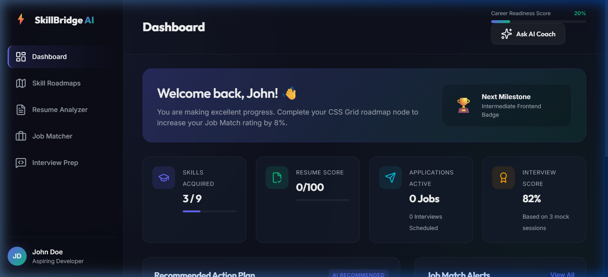
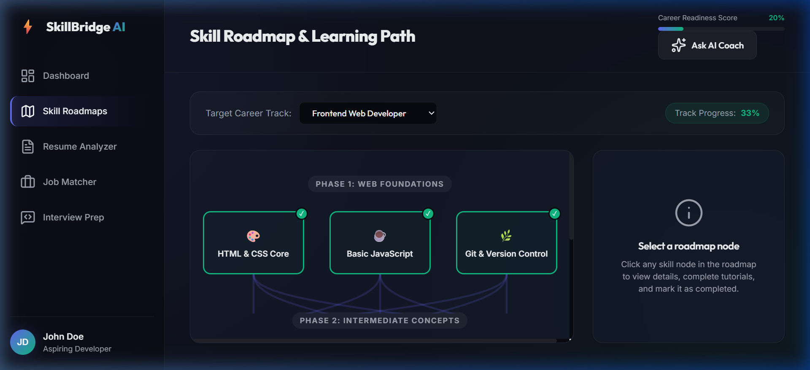
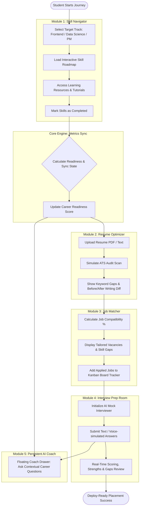

# ⚡ SkillBridge AI – Career Guidance & Job Assistant

**Track**: Agents for Good  
SkillBridge AI is a premium, interactive web-based career navigator and assistant designed to guide students and freshers from skill acquisition to job placement.

---

## 📸 Visual Layout

### Dashboard Hub


### Skill Roadmaps


---

## 🔄 Application Flow & System Architecture

Below is the conceptual flow of a student's journey through the SkillBridge AI platform:



---

## 📘 Detailed Feature Guide

### 1. 🗺️ Skill Roadmaps (Module 1)
*   **Dynamic Tracks**: Tracks are available for **Frontend Developer**, **Data Scientist**, and **Associate Product Manager**.
*   **Interactive Node Graph**: Connects skill milestones sequentially (Foundational ➔ Intermediate ➔ Advanced). Completed nodes are styled with an active emerald border and checkmark.
*   **Inspector Panel**: Click a node to load curated resources (MDN, GitHub, Kaggle, SVPG tutorials), sub-topics checklist, and a toggle button to mark complete.
*   **Readiness Scoring**: Completing nodes updates the local state and syncs with the overall dashboard readiness progress bar.

### 2. 📄 Resume ATS Optimizer (Module 2)
*   **File Drop Zone**: Supports drag-and-drop file inputs or direct text pasting.
*   **ATS Audit Score**: Returns a 0-100 rating based on keyword matching density, action-verb counts, and formatting checklists.
*   **Interactive Diffs**: Provides red/green line comparisons of generic statements vs. high-impact, quantified achievements.
*   **Keyword Extraction**: Flags missing technical items relative to target job specifications.

### 3. 💼 Job Matcher & Kanban Tracker (Module 3)
*   **Compatibility Calculations**: Jobs compute a dynamic compatibility rating based on matching skills:
    $$\text{Compatibility Score} = \left( \frac{\text{Skills Acquired}}{\text{Total Job Required Skills}} \right) \times 100$$
*   **Skill Gap Notifications**: Highlights missing skills on each job card with direct links back to corresponding Roadmap nodes.
*   **Kanban Dashboard**: Push applied jobs to track hiring stages (Applied ➔ Interviewing ➔ Offered) with full local caching.

### 4. 🎤 Mock Interview Prep Room (Module 4)
*   **Role-Specific Questions**: Features technical and behavioral question banks.
*   **Speech Simulation**: Built-in voice input simulator for mock spoken responses.
*   **Grading Scorecard**: Displays response completeness, vocabulary strength, STAR method criteria checks, and ideal model answers.

---

## 🛠️ Local Execution & Verification

Since the codebase is serverless and dependency-free, it can be tested instantly:

1.  **Launch a Local Server**:
    ```powershell
    # In Windows PowerShell:
    python -m http.server 8000
    ```
2.  **Open Browser**: Go to `http://localhost:8000/`.
3.  **Data Caching**: All progress (completions, resumes, Kanban stages, and test answers) is saved inside `localStorage`, meaning refreshing the browser preserves your work.

---

## ⚡ Deployment Blueprints

*   **Vercel**: Deploy instantly with the Vercel CLI by typing `vercel` in the project root.
*   **GitHub Pages**: Push changes to a repository and enable deployment under repository **Settings** ➔ **Pages**.
*   **Netlify**: Drag and drop this folder directly into the Netlify Dashboard upload box.
